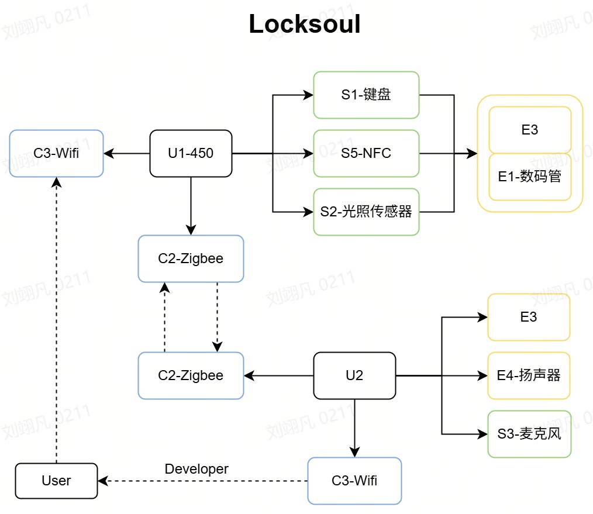
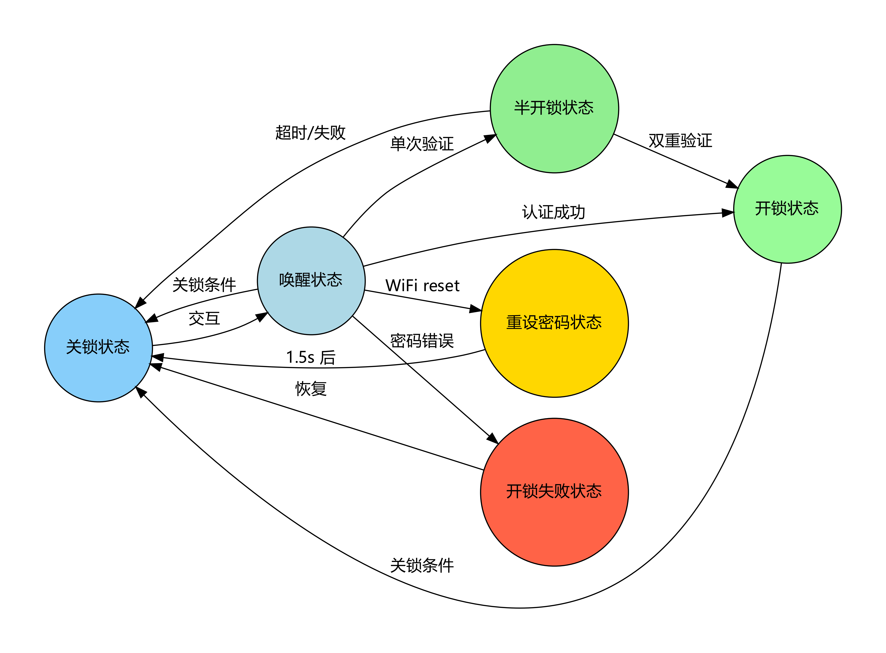
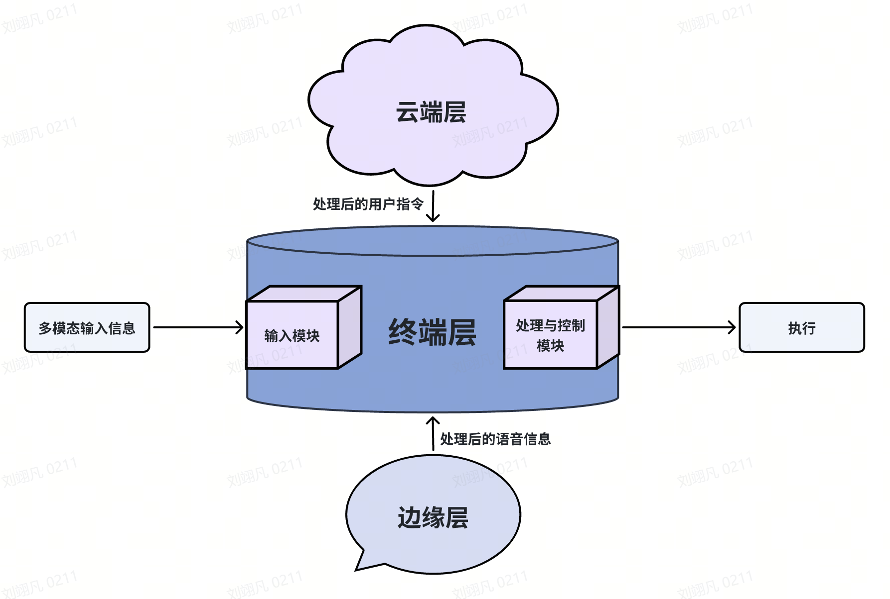

# 智能门锁PRO—主程序逻辑

（位置：**demo\Project\Application\src\main.c**）

By P2b

## 主循环状态机

### 状态划分：

- 关锁状态（待机状态）
- 唤醒状态（待输入状态）
- 开锁状态
- 重设密码状态
- 半开锁状态（单NFC/语音识别状态）通过NFC或语音识别其中一个验证方式时进入此状态，此状态下在10s内成功接受另外一种验证方式时可进入开锁状态

### 状态转换

#### **关锁状态**

- **关锁状态**接收到如下输入会进入**唤醒状态**

  >- 检测到人体；
  >- 检测到按键输入
  >- 检测到NFC卡
  >- 检测到任何WIFI指令

  注：连续3次以上输入密码输入错误会使系统在接下来的20s内被强制锁定在关锁状态，只有成功开锁才会解除惩罚

#### **唤醒状态**

- **唤醒状态**接收到如下输入会进入**开锁状态**

  >- 检测到正确按键密码
  >- 检测到合适的WIFI指令（开锁指令，要求用户在客户端键入密码）

- **唤醒状态**接收到如下输入会进入**半开锁状态**

  >- 检测到正确身份的NFC卡
  >- 检测到正确的语音暗号输入

- **唤醒状态**接收到如下输入会进入**关锁状态**

  > - 检测到按键按下关门键
  > - 检测到WIFI指令传入关锁指令
  > - 连续等待20s用户无动作

#### 开锁状态

- **开锁状态**接收到如下输入会进入**关锁状态**

  >- 检测到按键按下关门键
  >- 检测到WIFI指令传入关锁指令
  >- 连续等待20s用户无动作

#### 重设密码状态

- 系统会在接收到`WIFI指令：reset`时进入该状态，并在重设密码成功后展示1.5s的新密码

#### 半开锁状态

- **半开锁状态**会在接收到以下输入时进入**开锁状态**

  >- NFC成功验证后10s内，检测到正确的语音指令
  >- 语音指令已成功验证10s内，检测到正确的NFC卡身份

- **半开锁状态**会在接收到以下输入时进入**关锁状态**

  >- 进入此状态后连续10s无操作
  >- NFC成功验证后10s内，检测到错误的语音指令
  >- 语音指令已成功验证10s内，检测到错误的NFC卡身份

- **半开锁状态**会在接收到以下输入时保持**半开锁状态**

  >- NFC成功验证后10s内，检测到正确的NFC身份
  >- 语音指令已成功验证10s内，检测到正确的语音指令

## 用户可用指令表

|         用户指令          |      对应操作       |
| :-----------------------: | :-----------------: |
|       unlock <密码>       |        开锁         |
|   lock [密码 + in/out]    | 关锁/反锁/解除反锁  |
|  reset <原密码> <新密码>  |      重置密码       |
|           check           |    检查门锁状态     |
| nfc <add/remove> <身份ID> | NFC卡授权与删除授权 |
| tempkey <密码> <临时密码> |    访客临时密码     |
|           help            |  返回所有可用指令   |

## 系统架构说明

### 端 - 边 - 云协同架构

灵锁系统采用三层架构设计，各层功能明确且协同工作，确保系统高效、安全运行：

#### 终端层

终端层作为用户交互的物理接口，包含多模态输入模块和机电控制模块：

- 多模态输入模块：
  - S1 按键子板 + E1 数码管：支持 4 位数字密码输入与显示，兼容通过 C3 模块下发的动态密码（如限时访客密码），具备输入掩码保护功能。
  - S5 NFC 模块：支持 NFC 卡及手机 NFC 开锁，需预先通过云端绑定授权设备 ID。
  - U2 语音识别模块：集成离线语音识别引擎，支持预设口令（如 "开门"）触发开锁，断网时仍可正常使用。
  - S7 人体检测 + S2 光照传感器：采用红外感应技术，人体靠近时自动唤醒操作界面，结合光照传感器实现低光环境下的 LED 自动补光。
- 机电控制模块：
  - E3 窗帘模拟组件：用于状态反馈演示，开锁时联动窗帘动作，直观展示系统状态。
  - U1 状态机管理单元：基于硬件实现门锁状态（锁定 / 解锁 / 告警）维护，支持 15s 无操作自动锁门功能，以及5次错误触发30秒锁定的熔断机制。

#### 边缘层

边缘层以 U2 主控芯片为核心，实现本地数据处理与决策：

- 实时处理终端层输入数据，执行认证逻辑与状态机转换，减轻云端负载。
- 集成本地认证引擎，支持语音数据的独立处理。
- 通过 C2 ZigBee 模块与云端通信，支持断网时的本地认证缓存与网络恢复后的自动同步。
- 本地决策响应速度 < 100ms，确保紧急情况下的快速响应。

#### 云端层

云端层提供远程管理与服务支持：

- NetAssist 远程管理平台：支持用户通过 PC 或移动端发送开锁、锁定、密码重置等指令。
- 动态密码服务：支持生成一次性或限时密码（如 1 小时有效期），通过 TLS 1.3 加密下发至边缘层。
- 设备状态监控：实时获取门锁状态（锁定 / 解锁），支持异常告警推送。

暂时无法在飞书文档外展示此内容

### 系统交互流程

灵锁系统的核心交互流程包括：

1. 本地认证流程：
   1. 终端层检测到用户输入（密码 / NFC / 语音）
   2. 边缘层进行本地认证处理
   3. 认证成功后驱动机电控制模块执行开锁动作
   4. 终端层反馈状态（数码管显示、RGB 灯变化）
2. 远程控制流程：
   1. 云端接收用户指令（如 NetAssist 发送 unlock 命令）
   2. 云端下发指令至边缘层
   3. 边缘层执行指令并更新门锁状态
   4. 边缘层回传执行结果至云端，云端同步至用户界面

